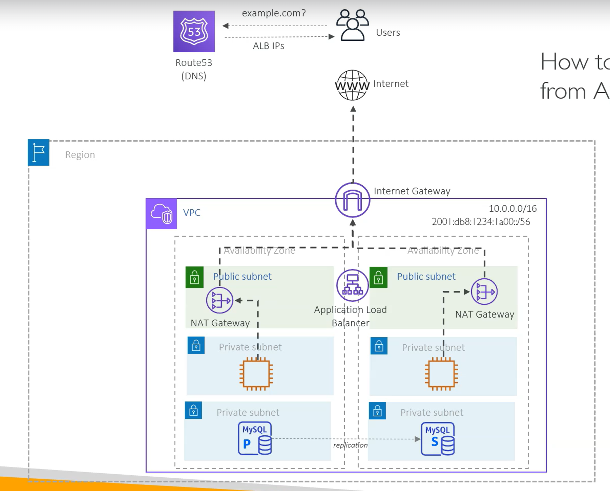

# Overview of AWS Networking

→ 2계층 아키텍처(웹-DB) 

→ 3계층 아키텍처(Web(ALB), App(EC2), Data(DB))

## 리전 선택하기

## AZ 선택하기

**VPC**는 CIDR 대역으로 여러 AZ들을 포함하고 있다

## Subnet 만들기

### **Public subnet**

**Inetrnet gateway**랑 연결되어 인터넷이 되게 함

- **Route 53**으로 IP 대신 도메인 이름으로 접근할 수 있게 함

### **Private subnet**

- **Application Load Balancer**는 최소 두 개의 AZ 안의 **서브넷**에 붙어있음
    - ALB는 **여러 AZ의 서브넷**에 걸쳐 존재하고
    - Target Group에는 **여러 AZ에 흩어진 타겟(EC2/ECS/IP)** 이 들어갈 수 있음
- **Database 서버**는 아웃바운드 인터넷 트래픽이 필요 없기에, 웹 서버와 다른 서브넷에 두는 것이 합리적 - **앱 서버와 라우팅 정책 분리**
- **NAT** : 각 앱 서버는 인터넷에 직접적으로 연결되지는 않으면서, 아웃바운드 트래픽이 필요함
    - Public IP 없이 아웃바운드만 가능하게 함!!

## VPC Endpoint

### **Gateway VPC Endpoint**

- 프라이빗 서브넷 라우팅 테이블에 **S3** or **DynamoDB → VPC 경로**가 생김
- **NAT 비용이 없어짐**. 대신 S3 데이터 전송/요청 비용은 有

### **Interface VPC Endpoint** (**PrivateLink**)

- VPC 안에 **ENI**(Private IP가 있는 네트워크 인터페이스)로 서비스 API를 호출
- 엔드포인트(ENI) 시간당 과금, 처리된 데이터량 과금

SaaS : 다른 사람이 다른 VPC에서 호스팅하는 서비스형 소프트웨어

- 금융, 보안 등의 이유로 인터넷 경유(NAT 사용)을 금지해야 할 때 위같은 사설 연결을 사용할 수 있다

## How to communicate in Hybrid

### **Site to Site IPSec VPN**

- **온프레미스 ↔ AWS VPC** 사이에 **IPsec 터널**을 인터넷 위에 하나 뚫어서 **사설 IP 대역끼리 직접 통신**하게 만드는 구조
    - Customer Gateway (CGW) : 온프레의 방화벽/라우터 (공인 IP 1개 필요)
    - AWS VPC에 붙어있는 **Virtual Private Gateway (VGW)** 또는 **Transit Gateway**
    - 공인 인터넷은 쓰지만 IP 패킷 내용은 전부 암호화

### **AWS Direct Connect (DX)**

- 대역폭/지연/패킷로스가 인터넷 상황에 따라 흔들림 - 피크 시간대, 통신사 라우팅 변화 등에 취약해짐
- 인터넷이 아니라 **전용 회선/전용 경로**로 AWS에 붙음
- 더 낮은 지연 + 더 안정적인 처리량 + 예측 가능한 네트워크 품질
    - 하지만 IPsec VPN과 다르게 DX는 기본적으로 암호화가 아니다

## VPC Private Connectivity options

### VPC Peering

- VPC간 1대1 연결
- VPC가 4개라면 총 6개의 연결, 10개라면 총 45개의 피어링 연결이 필요함 - not scalable

### Transit Gateway

- 모든 VPC를 Transit gateway에 연결 - 모든 VPC 간 소통 가능
    - **같은 리전**의 VPC만 연결 가능
    - **Transit Gateway Peering** - 리전마다의 Transite Gateway를 연결시켜서 다른 리전간 VPC들과 소통 가능하게 함
- 온프레 (CGW) 와의 연결도 지원

### Cloud WAN

TGW를 수십 개 운영할 때 (리전이 여러 개고, VPC가 수십~수백 개)

같은 VPC가 Cloud WAN에 붙어도, 어떤 세그먼트에 붙이냐에 따라 통신 가능 범위가 달라짐

- **Development segment**
    - 개발 VPC들 묶음
    - Prod랑 기본적으로 **격리**
- **Production segment**
    - 서비스 운영망
    - 개발망과 **분리**, 더 강한 통제/감사
- **Shared Services segment**
    - 공용 자원(AD/SSO, 로깅, 모니터링, CI/CD, ECR, 프록시, 보안툴, 중앙 DNS 등)
    - Dev/Prod가 **필요한 것만** 접근하도록 허용된 경로 제공

### VPC Lattice

VPC 사이를 서비스 단위로 연결 
(위 서비스들은 네트워크 연결이지만, Lattice는 서비스(L7) 연결)

서비스 디스커버리, 도메인 이름 관리…

- ex. `frontend`가 `order.svc.example.com` 호출하면 실제로는 **다른 VPC에 있는 order 서비스로 사설로 라우팅**해줌
- 따라서 서비스 간 호출을 **도메인 기반**으로 통일할 수 있다 
== VPC가 달라도, 같은 내부망의 마이크로 서비스처럼 보이게 할 수 있다